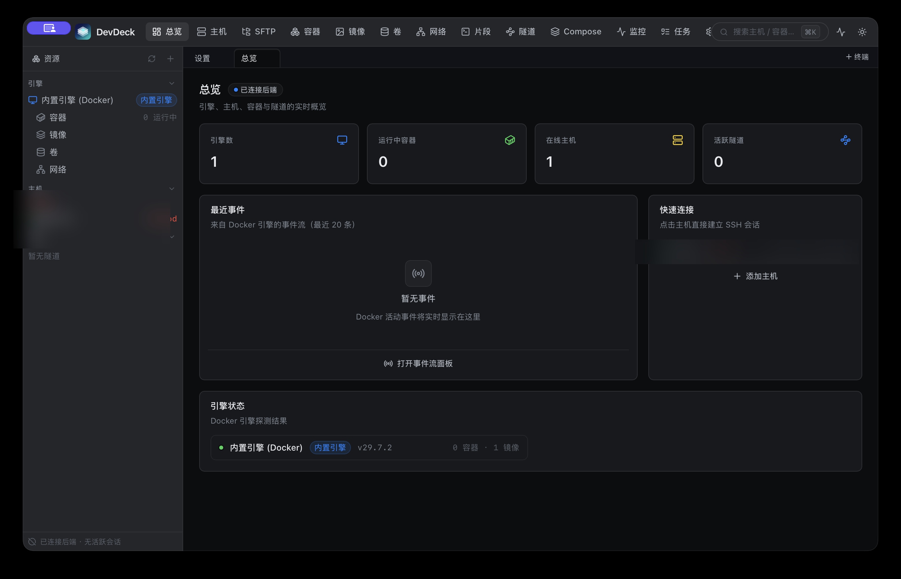
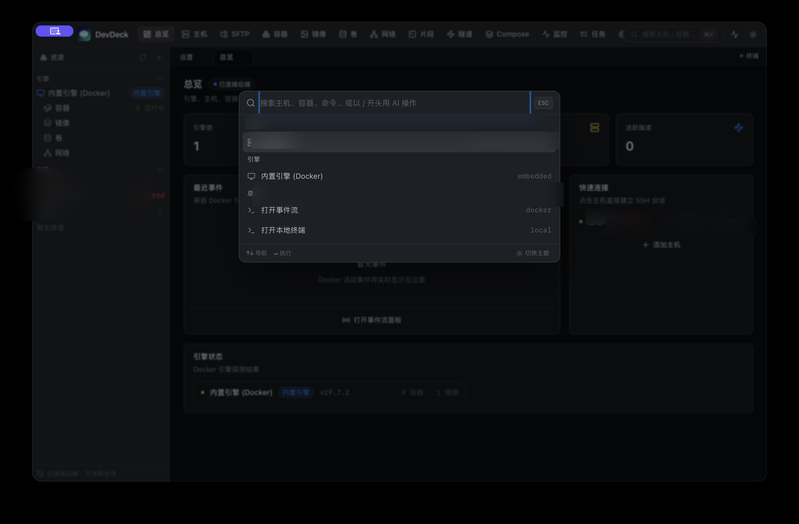
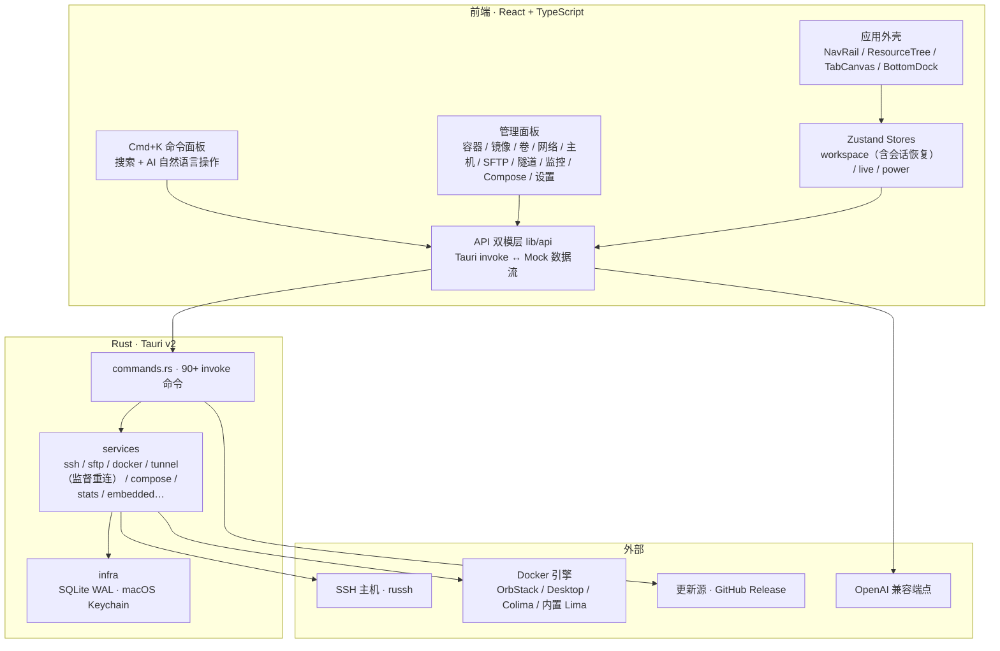

# DevDeck

> macOS 原生工作台・SSH / SFTP / Docker / 隧道 一体化

DevDeck 是一个基于 **Tauri v2 + Rust** 构建的 macOS 原生高效远程连接与容器管理工具：SSH 远程终端、SFTP 文件管理、Docker 容器生态、端口隧道与 Compose 编排，集成在一个低功耗、轻体积的原生应用中。**内置 Docker 引擎**（Apple 原生虚拟化 + 真 dockerd），开箱即用，不依赖 OrbStack / Docker Desktop。




*总览页：引擎、主机、容器与隧道的实时概览（截图中主机信息已模糊处理）*




*Cmd+K 全局命令面板：搜索主机 / 容器 / 命令，或以&#x20;*`/`*&#x20;开头使用 AI 自然语言操作*

## 核心特性

**远程与终端**


* SSH 2.0（口令 / 私钥 / Keychain /ssh-agent）、TOTP 二次验证（keyboard-interactive）、PTY 分屏、known\_hosts TOFU、keepalive 自动重连

* 跳板机（Jump Host）、会话复用（同主机共享 SSH 传输）、会话录制（asciinema `.cast` 导出）、广播终端、ZMODEM 传输

* 本地终端（macOS PTY shell）、sudo 密码提示自动填充（可在设置关闭）

* **工作区会话恢复**：重启应用后自动恢复标签页 ——SSH / 本地终端按 Keychain 凭据重建真实会话，面板 / 详情页直接恢复

**容器与编排**


* **内置 Docker 引擎**：自管 Linux 虚拟机（Apple 原生虚拟化 + 真 dockerd），socket 透传 `~/.lima/devdeck/sock/docker.sock`，自动拉起 / 接入

* Docker / Podman 引擎探测（OrbStack / Docker Desktop / Colima / Podman / 内置）、容器生命周期与批量操作、一键 Exec 终端、镜像拉取进度、运行新容器表单、卷 / 网络管理

* 私有镜像仓库配置（Basic Auth / Bearer Token，凭据仅存 Keychain）、远程 Docker over SSH、Compose（up / down / logs / build / restart / pull）、卷挂载反查

* 事件驱动端口转发（容器启动自动暴露 localhost 隧道）+ Docker `/events` 自愈转发

**网络与隧道**


* Local / Remote 端口转发、SOCKS5 动态代理（RFC 1928）、隧道命名与启用状态、实时流量统计

* **监督式自动重连**：SSH 闪断 / 端口瞬占后按指数退避（2s → 30s 封顶）自动重建转发，无需人工干预

**主机能力**


* 主机分组与环境色卡、无 Agent 监控（CPU / Disk / RAM）、主机进程查看（复用活跃 SSH 会话执行 `ps`）

**AI 助手**


* **AI 命令面板**：Cmd+K 后以 `/` 开头输入自然语言（如「重启 web 容器」「连接测试机」「打开监控」），映射为受控动作执行 —— 只允许打开面板 / 连接主机 / 操作容器等安全白名单动作，**绝不执行任意 shell**

* **日志智能诊断**：容器日志页一键 AI 分析，判断异常（错误 / 崩溃 / OOM / 反复重试）、给出原因与排查建议

* OpenAI 兼容端点：支持任意网关（DeepSeek / 硅基流动 / Ollama 等），Key 仅存本机 localStorage，仅用于 Authorization 头

**效率与系统**


* Snippets 常用命令库（`{{变量}}` 占位替换）、任务队列面板、事件流面板、配置导入导出（不含密钥）

* i18n 中英双语、低功耗状态机 + App Nap 豁免、闲置自动锁定（PIN 存 Keychain）、macOS 托盘

* 自动更新（tauri-plugin-updater）、Sentry 崩溃上报（条件初始化）、MCP Server（`devdeck-mcp`，供 Claude Code / Cursor 直连本地 Docker 引擎）

## 技术栈


| 层       | 技术                                                                                                                             |
| ------- | ------------------------------------------------------------------------------------------------------------------------------ |
| UI      | Tauri v2 Web · React 18 · TypeScript · Tailwind CSS · Shadcn UI · xterm.js (WebGL) · Zustand · TanStack Query · cmdk · i18next |
| 核心      | Rust · Tokio · russh / russh-sftp · bollard · rusqlite (SQLite WAL) · zmodem2                                                  |
| 内置引擎    | Lima (vmType=vz, Apple Virtualization.framework) + 真 dockerd（rootless）+ socket 透传                                              |
| 系统      | macOS Keychain・Dispatch QoS・App Nap 豁免・Tauri 托盘・tauri-plugin-updater・window-vibrancy                                           |
| CI / 发布 | GitHub Actions・公证 (notarytool)・签名更新源 (minisign feed)・能耗 / 体积基线                                                                 |

> 说明：K8s / 独立 VM 运行时（USB 透传 /x86 模拟）不在当前范围（防蔓延决策）。内置 Docker 引擎与 OrbStack 同架构（Lima 承载真 dockerd）。

## 架构




**安全设计**


* 凭据（SSH 密码 / 私钥 / 仓库 Token / 闲置锁 PIN）一律存 **macOS Keychain**，SQLite 只存引用；AI Key 仅存本机 localStorage

* 首次连接 known\_hosts TOFU 校验，防中间人攻击

* AI 动作白名单：自然语言只能映射到受控操作，无法执行任意命令

## 快速开始


```
# 前置：Node.js ≥ 18、pnpm、Rust toolchain；内置引擎可选 brew install lima

# 前端开发（浏览器模式，mock 数据可预览全部面板，无需 Rust）

cd frontend && pnpm install && pnpm dev

# 桌面应用开发（Tauri，含 Rust 热重载；需在项目根目录调用）

./frontend/node_modules/.bin/tauri dev
```


* 前端不依赖 Rust：`lib/api.ts` 检测不到 Tauri 环境时自动回退 mock 数据流

* 命令契约：前端 `lib/api.ts` ↔ Rust `src-tauri/src/commands.rs` 需同步修改（接口对齐测试会拦截漂移）

* 设计 token：仓库根 `DESIGN.md`（Google design.md 规范）

* 自动更新签名：`src-tauri/.signing/devdeck_updater.key`（本地生成，**绝不可提交**），公钥在 `tauri.conf.json`

* Sentry：构建时设置环境变量 `DEVDDECK_SENTRY_DSN` 即可启用崩溃上报

## 项目结构


```
DevDeck/

├── DESIGN.md           # 设计 token 规范

├── assets/screenshots/ # 产品截图（README 引用）

├── src-tauri/          # Tauri v2 + Rust 核心层

│   ├── capabilities/

│   ├── .signing/       # 更新源签名密钥（gitignore，不入库）

│   └── src/

│       ├── commands.rs       # Tauri invoke 命令（前端契约，90+ 命令）

│       ├── services/         # ssh / docker / sftp / tunnel / stats / power

│       │                     #   + auto\_forward / compose / remote\_docker / zmodem / embedded

│       ├── infra/            # db (SQLite) / keychain

│       ├── models.rs         # serde 契约模型（camelCase）

│       └── tray.rs           # macOS 托盘

├── frontend/           # React 前端（导航栏 / 资源树 / Tab 画布 / 底部面板 / xterm）

│   └── src/

│       ├── app/        # 应用外壳（NavRail / ResourceTree / TabCanvas / Cmd+K / TerminalView）

│       ├── features/   # 管理面板（容器/镜像/卷/网络/主机/SFTP/隧道/监控/片段/任务/Compose/设置）

│       ├── stores/     # workspace / live / power（Zustand）

│       └── lib/        # API 双模层 / ai / queries / types / i18n

├── docs/               # 内部设计/评审文档（本地维护，不入库）

└── .github/workflows/  # release.yml（公证+签名 feed） / quality.yml（测试+能耗基线）
```

## 测试与质量


```
# 后端：单测 + clippy（零告警）

cd src-tauri && cargo test && cargo clippy --all-targets

# 前端：单测 + 类型检查 + 构建

cd frontend && pnpm test          # vitest run

cd frontend && npx tsc --noEmit   # 类型检查

cd frontend && pnpm build         # tsc -b + vite build
```


* **接口对齐测试**：锁定前端 invoke 命令名与 mock handler 一致（与 Rust 后端下划线命名对齐），防止「真实运行断接口、mock 却正常」的命名漂移

* **workspace 行为测试**：覆盖 openTab 去重、closeTab 会话释放等核心逻辑

* **CI 质量门**：`quality.yml` = cargo test + 能耗基线 + 前端 tsc + vitest + build；`release.yml` = tag 触发公证发布

* **真机验证**：改前端源码后需重新打包（`tauri build --debug`），旧 `.app` 内嵌旧资源不生效

## License

DevDeck 采用 **MIT License** 开源发布，完整许可条款见 [LICENSE](LICENSE)。

**你可以自由地：**

| 权利 | 说明 |
|---|---|
| 商用 | 将本项目用于商业产品与服务，无需付费 |
| 修改 | 任意修改源码，并可分发你的修改版本 |
| 分发 | 以任何媒介传播本软件及其副本 |
| 私有使用 | 私下使用，无公开源码义务 |

**唯一义务：** 在你的副本中保留原始版权声明与许可声明（即 `LICENSE` 文件顶部声明），不得移除或篡改。

**免责声明：** 本软件按「现状」（AS IS）提供，作者不对**适销性**及**特定用途适用性**作任何明示或暗示的担保；因使用本软件造成的任何直接或间接损害，作者不承担责任。你需自行评估使用风险，包括但不限于：连接生产环境、执行远程命令、管理容器数据等场景。

完整许可文本：

```
MIT License

Copyright (c) 2026 DevDeck

Permission is hereby granted, free of charge, to any person obtaining a copy
of this software and associated documentation files (the "Software"), to deal
in the Software without restriction, including without limitation the rights
to use, copy, modify, merge, publish, distribute, sublicense, and/or sell
copies of the Software, and to permit persons to whom the Software is
furnished to do so, subject to the following conditions:

The above copyright notice and this permission notice shall be included in all
copies or substantial portions of the Software.

THE SOFTWARE IS PROVIDED "AS IS", WITHOUT WARRANTY OF ANY KIND, EXPRESS OR
IMPLIED, INCLUDING BUT NOT LIMITED TO THE WARRANTIES OF MERCHANTABILITY,
FITNESS FOR A PARTICULAR PURPOSE AND NONINFRINGEMENT. IN NO EVENT SHALL THE
AUTHORS OR COPYRIGHT HOLDERS BE LIABLE FOR ANY CLAIM, DAMAGES OR OTHER
LIABILITY, WHETHER IN AN ACTION OF CONTRACT, TORT OR OTHERWISE, ARISING FROM,
OUT OF OR IN CONNECTION WITH THE SOFTWARE OR THE USE OR OTHER DEALINGS IN THE
SOFTWARE.
```